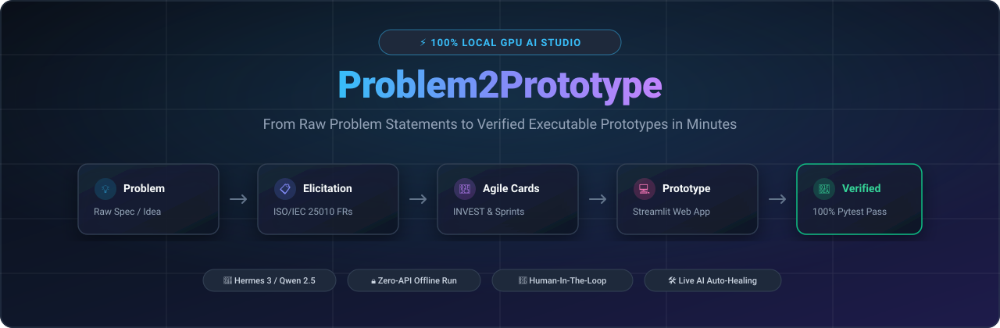

# ⚡ Problem2Prototype (P2P Studio)

<div align="center">

<p align="center">
  
</p>

### *Transform Raw Problem Statements into Verified, Executable Software Prototypes & Automated Tests in Minutes.*

[](https://www.python.org/)
[](https://streamlit.io/)
[](https://ollama.ai/)
[](https://nousresearch.com/)
[](https://pytest.org/)
[](LICENSE)

</div>

---

## 📖 Overview

**Problem2Prototype (P2P)** is an open-source, local GPU-accelerated Software Engineering Studio. It bridges the gap between high-level business ideas and functional code by automating the complete early software lifecycle:
1. **Requirements Elicitation & ISO/IEC 25010 Specification**
2. **Agile Story Generation & INVEST Quality Verification**
3. **Sprint Planning & Velocity Estimation**
4. **Interactive Tech Stack Negotiation & Executable Code Generation**
5. **Automated Test Generation & Live Pytest Auto-Healing**

Powered 100% locally by **Hermes 3 (`hermes3:8b`)** / **Qwen 2.5 (`qwen2.5:7b`)** over **Ollama** with zero API costs, full privacy, and sub-second GPU inference.

---

## 🌟 Key Features

- **11-Stage Autonomous Engineering Pipeline**:
  - **Stage 1 (Stakeholder Identification)**: Internal, external, direct, and regulatory stakeholder mapping.
  - **Stage 2 (Goal & Needs Analysis)**: Operational goals, pain points, and critical success criteria.
  - **Stage 3 (Elicitation Selection)**: Context-aware selection of interviews, surveys, and workshops.
  - **Stage 4 (Elicitation Run)**: Concrete questionnaires, Likert surveys, and workshop discovery agendas.
  - **Stage 5 (FR/NFR Specification)**: Structured Requirements Specification (FRS/NFRS).
  - **Stage 6 (Agile User Story Cards)**: Front-of-card (User Persona, Story, Fibonacci Points, MoSCoW) and Back-of-card (Given-When-Then Acceptance Criteria).
  - **Stage 7 (INVEST Quality Gate)**: Audit scorecard checking Independent, Negotiable, Valuable, Estimable, Small, and Testable dimensions.
  - **Stage 8 (Sprint Planning & Selection)**: Dependency-based sprint groupings and interactive sprint selection.
  - **Stage 9 (Tech Stack Negotiation & Prototyping)**: Architect-Developer negotiation chat + decoupled pure Python domain engine & Streamlit web app.
  - **Stage 10 (Test Case Generation)**: Structured test specification cards + executable `pytest` suite.
  - **Stage 11 (Automated Testing & AI Auto-Healing)**: Subprocess `pytest` runner with live pass/fail badges and one-click automated code healing.

- **Interactive Streamlit Web Studio (`app.py`)**:
  - Visual stage stepper with side-by-side Human-In-The-Loop (HITL) steering.
  - Live markdown editors, prompt refinement inputs, and real-time approval buttons.
  - One-click project deliverables `.zip` export.

- **Clean SOLID Architecture (`src/`)**:
  - Modular configuration, prompt registry, stage handlers, and test execution runners.

---

## 🚀 Quick Start

### 1. Clone & Setup Virtual Environment
```powershell
git clone https://github.com/Prince-Patel84/Problem2Prototype.git
cd Problem2Prototype

# Create & activate local virtual environment
python -m venv .venv

# Install dependencies
.venv\Scripts\python -m pip install -r requirements.txt
```

### 2. Configure Local Ollama Engine
Ensure Ollama is running on your machine:
```powershell
ollama pull hermes3:8b
```
*(Default settings in `.env` automatically allocate 100% GPU offloading)*

### 3. Launch the Web Studio
```powershell
.venv\Scripts\streamlit run app.py
```
Open **`http://localhost:8501`** in your browser.

---

## 💻 CLI Usage

Run the pipeline from the command line with interactive Human-In-The-Loop review:

```powershell
# Interactive mode (prompts for input or loads existing project):
.venv\Scripts\python main.py

# Run with a custom system description / case study:
.venv\Scripts\python main.py --input "path/to/any_problem_statement.txt"

# Run automated batch mode:
.venv\Scripts\python main.py --auto
```

---

## 🧪 Automated Testing

Verify the architectural stage handlers and generated prototype logic:

```powershell
# Test architecture & pipeline modules (5 Tests)
.venv\Scripts\pytest tests/ -v

# Test generated prototype logic (6 Tests)
.venv\Scripts\pytest prototype/test_prototype.py -v
```

---

## 📁 Repository Structure

```
Problem2Prototype/
├── app.py                      # ⚡ Streamlit Web Studio Application
├── main.py                     # 💻 Scriptable CLI Pipeline Runner
├── README.md                   # 📖 Documentation & Setup Guide
├── requirements.txt            # 📦 Pinned Python Dependencies
├── .env                        # ⚙️ Ollama & 100% GPU Configuration
├── .gitignore                  # 🛡️ Git Hygiene Rules
│
├── docs/                       # 🎨 Banners, Logos & Screenshots
│   ├── banner.png              # Hero Banner
│   └── logo.png                # Studio Logo
│
├── src/                        # 🏛️ Modular SOLID Package
│   ├── core/                   # Config & GPU LLM Service
│   ├── prompts/                # Domain-Agnostic Prompt Registry
│   ├── stages/                 # Handlers for Stages 1 to 11
│   └── utils/                  # Code Extractor & Subprocess Pytest Runner
│
├── tests/                      # 🧪 Architecture Unit Test Suite
├── prototype/                  # 🚀 Generated Domain Engine & UI App
└── artifacts/                  # 📊 Output Markdown Specifications
```

---

## 📄 License
Distributed under the **MIT License**.
